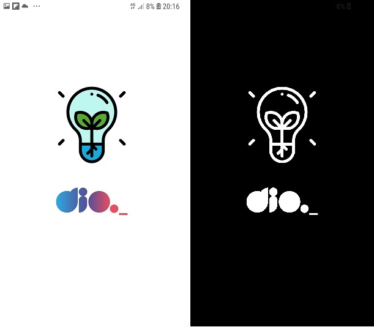

# Aplicativo Flashlight/Lamparina

Este desafio faz parte do bootcamp da Dio, nele desenvolvi um aplicativo em react-native que muda o modo de exibição quando o usuário toca na tela.

## Conteúdo

* StyleSheet
* Hook useState
* Hook useEffect
* Lifecicly ReactJS

